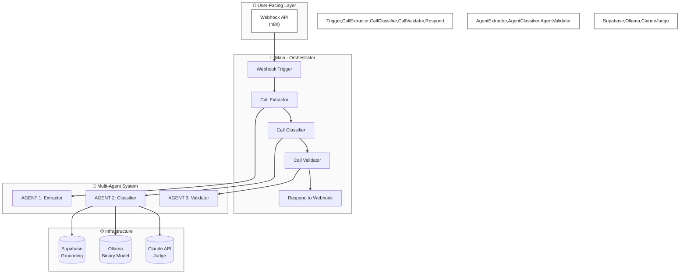
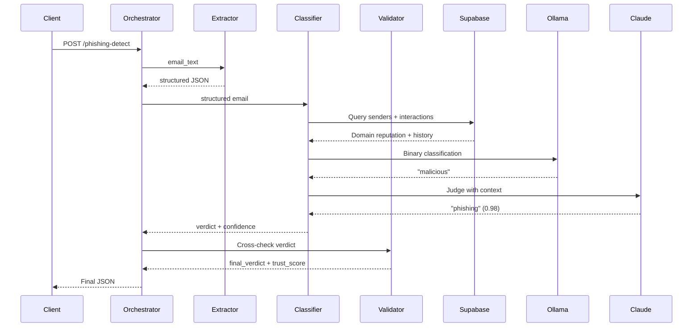
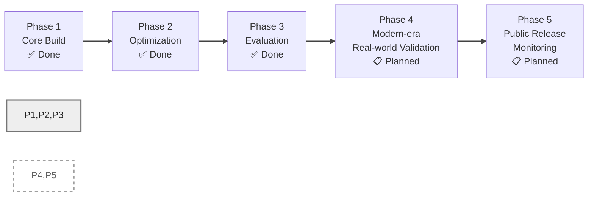

# 🛡️ AI Phishing Detection Agent

**A multi-agent AI system that classifies emails as phishing, BEC, spam, or legitimate — built around a fine-tuned Llama 3.2 3B model, a Claude judge, and Supabase grounding, orchestrated in n8n.**

[](https://n8n.io)
[](https://ollama.com)
[](https://supabase.com)
[](https://anthropic.com)
[](https://opensource.org/licenses/MIT)

---

## ⚠️ Read This First

> This project reports **two very different accuracy numbers, on purpose.**
>
> - **92.5–100% on synthetic benchmarks** (data matching the model's training distribution)
> - **~56% accuracy / 25% recall on a real-world 2000s-era phishing corpus**
>
> The gap is the most important finding in this repo — a textbook **training/test domain shift**. It's documented in [Limitations](#️-limitations--honest-findings), not buried. I chose to report both numbers rather than only the flattering one.

---

## 🎯 What This Is

An end-to-end email threat classifier: raw email in, structured verdict out (`phishing` / `bec` / `spam` / `legitimate`, plus a trust score and a human-review flag). Four specialized n8n workflows handle extraction, classification, validation, and orchestration. A fine-tuned Llama 3.2 3B makes the binary malicious/safe call locally via Ollama; Claude Haiku 4.5 acts as judge for the final label; Supabase provides sender-reputation and interaction-history grounding on every email.

*Built AI-assisted: I designed the architecture, ran every experiment, and debugged every failure documented below — implementation via n8n visual workflows (JSON) and Colab notebooks. Built over ~1–2 weeks of hands-on sessions.*

---

## 🏆 Results

| Evaluation | Dataset | Result |
|---|---|---|
| Single-pipeline benchmark | 45 emails (incl. 5 prompt-injection attacks) | **100% exact match, 100% alert accuracy** |
| Multi-agent benchmark | 40 emails | **92.5% exact match, 97.5% alert accuracy, 100% recall, 0 false negatives** |
| Adversarial gold set (single judge, hand-labeled) | 30 hard emails, 6 categories | **83.33% agreement** |
| Adversarial gold set (LLM-as-jury: Claude + Gemini + Llama) | Same 30 emails | **96.67% agreement** |
| Real-world corpus (1999–2005 phishing) | 200 real emails | **56.5% accuracy, 25.3% recall, 82.8% precision, 95% specificity** |
| Prompt-injection resistance | 5 adversarial emails | **5/5 caught** |
| Inference latency (after optimization) | Per email | **~4s** (down from ~30s; small-sample measurement, $0 added cost) |
| Cost | Per email | **~$0.0002** (Claude judge only; everything else free/local) |

---

## 🔨 How It Was Built

### 1. MVP: n8n + Claude + Supabase

Started with the simplest thing that could work: an n8n webhook receives an email, Claude classifies it, Supabase stores the result. Baseline on 10 emails: **50%**. The metric itself was wrong — `suspicious` counted as incorrect even though in production it should trigger an alert. Fixed the metric to measure *alert-worthiness*; accuracy went to ~70%.

### 2. Grounding + ablation study

Added two grounding signals, queried fresh on every email:
- **Static:** sender-domain reputation (`senders` table)
- **Behavioral:** sender↔recipient interaction history (`interactions` table) — catches BEC from trusted domains

Then proved each component's value with an ablation study:

| Variant | Grounding | Accuracy | Precision | Recall |
|---|---|---|---|---|
| A | None | 83.3% | 73.7% | 100% |
| B | Static only | **97.5%** | **95.7%** | 100% |
| C | Static + behavioral | 97.5% | 95.7% | 100% |

**Finding:** sender-domain grounding was the single biggest lever (+14 pts). Behavioral grounding didn't move the number on this set but is the only signal that can catch BEC from a known domain — kept for that reason.

### 3. Fine-tuning: four failures, then the breakthrough

Zero-shot Llama 3.2 3B scored 87.5% but missed phishing it should have caught. So I fine-tuned with LoRA (Unsloth, Colab T4, ~15 min). It failed four times before it worked:

| Attempt | Approach | Result |
|---|---|---|
| 1 | 4-class, imbalanced data | 30% — predicted "phishing" for everything |
| 2 | 4-class, balanced + cleaned | 30% — same failure |
| 3 | Binary (malicious/safe) | 60% — predicted "malicious" for everything |
| 4 | **Binary + reasoning-before-verdict** | **100%** ✅ |
| 5 | 4-class + reasoning | 30% — too complex for 3B on 419 examples |
| 6 | Hybrid (binary gate + Ollama sub-classifier) | 66% — sub-classifier too weak |

**The breakthrough:** training the model to write a one-sentence reason *before* the verdict (`"This email appears malicious: suspicious sender domain, urgency. Verdict: malicious"`) forced it to analyze the input instead of defaulting to the majority class. One formatting change: 60% → 100%.

Final config: LoRA rank 64, 419 examples → merged → GGUF Q4_K_M quant (6.4GB → 2GB) → served locally via Ollama. Since 4-class didn't respond to the same technique at this data scale, the 4-class label comes from a Claude Haiku judge — which also catches binary-model errors (defense in depth: on one benchmark email the binary model said `safe`, the judge correctly said `phishing`).

### 4. Multi-agent rebuild

Split the monolith into 4 n8n workflows — **Extractor → Classifier → Validator → Orchestrator**. The Validator cross-checks every verdict against grounding (6 rules; e.g. a "malicious" verdict on a known domain with history gets downgraded to `suspicious` for human review).

First benchmark run: **60% exact match**. Three bugs, all found and fixed:
1. Stale test nodes with a hardcoded domain hitting the wrong Supabase rows
2. Wrong auth header on the Supabase query (new key format)
3. Validator Rule 3 too aggressive — downgraded nearly every malicious verdict

After fixes: **92.5% exact match, 97.5% alert accuracy, 100% recall, zero false negatives** on 40 emails. The 4-agent pipeline scores slightly lower on exact match than the monolith *by design* — the Validator trades label precision for human-in-the-loop safety, which is the right tradeoff for a security product.

### 5. LLM-as-jury experiment

The hand-labeled 30-email gold set exposed one weak spot: spam-vs-phishing (40% agreement — aggressive marketing kept getting flagged as phishing). Ran three independent judges (Claude Haiku, Gemini Flash, local Llama) with majority vote: **96.67% agreement**, spam-vs-phishing fixed to 100%. Honest caveat: the local Llama judge errored on ~half the emails, so the jury was effectively two judges — still enough to catch each other's false positives. Not merged into the production pipeline (latency/complexity for a weak third vote); documented as a future enhancement.

### 6. The real-world test (and the honest finding)

Ran 200 real emails (100 phishing from a public 1999–2005 corpus + 100 legitimate) through the actual pipeline: **56.5% accuracy, 25.3% recall, 95% specificity**. The model almost never false-alarms on legitimate mail but misses ~75% of old phishing — because it was trained on 2026-style attacks (typosquats, credential harvest, BEC) and the test set is Nigerian-prince/pharma-spam era. Classic domain shift, documented as the headline finding rather than "fixed" by retraining on the old corpus (which would just move the mismatch, not remove it).

---

## 🏗️ Architecture





**Grounding (lightweight RAG):** two Supabase tables queried per email — `senders` (domain reputation) and `interactions` (sender↔recipient history) — rendered into a natural-language sentence injected into the model's context. The model is stateless; grounding is fetched fresh every call. It sharpens *precision* on known senders; on genuinely novel attacks "unknown sender" is itself the correct signal.

---

## 🧪 Evaluation Methodology

Three layers, easiest to hardest: **(1)** synthetic ablation study (40 emails, 3 grounding variants); **(2)** hand-labeled 30-email adversarial gold set across 6 hard categories (homoglyph domains, urgency-free BEC, legitimate-but-suspicious internal mail, spam resembling phishing, prompt injection, subtle phishing) — labeled by hand, never by an LLM; **(3)** real-world corpus test (200 emails, zero grounding advantage since none of the senders exist in the database). All benchmarks run through the actual n8n pipeline, not offline scripts. Eval harness and datasets live in `eval/`.

---

## ⚠️ Limitations & Honest Findings

- **Domain shift is the headline finding** (see table in [How It Was Built](#6-the-real-world-test-and-the-honest-finding)): 100% recall on synthetic 2026-style phishing, 25% on a 1999–2005 corpus. The fix is training data matching the production threat distribution — not a pipeline bug.
- Small hand-labeled sets (30–45 emails); not statistically powered.
- All synthetic training/eval data LLM-generated — may not reflect real attacker creativity.
- No SPF/DKIM/DMARC signals; local-only deployment, not load-tested.
- LLM-as-jury validated on the synthetic gold set only, not on the real-world corpus.

---

## 🛡️ Security (OWASP LLM Top 10)

| Risk | Mitigation | Status |
|---|---|---|
| LLM01 Prompt Injection | Email body treated as untrusted data; separated from instructions | 5/5 adversarial tests caught |
| LLM02 Insecure Output Handling | Fence stripping, guarded JSON parsing, field allowlisting, safe defaults | Verified |
| LLM03 Training Data Poisoning | Synthetic data, manually reviewed, balanced labels | Verified |
| LLM04 Model DoS | Rate limiting at webhook layer | Documented |
| LLM05 Supply Chain | Locked dependency versions | Verified |
| LLM06 Sensitive Info Disclosure | Synthetic data only — no real PII in training | Verified |
| LLM07 Insecure Plugin Design | API keys in n8n credentials, never hardcoded | Verified |
| LLM08 Excessive Agency | Classifier only — no auto-quarantine; `needs_review` flag for humans | By design |
| LLM09 Overreliance | Reasoning + trust score surfaced, not just a label; Validator downgrades over-confident verdicts | By design |
| LLM10 Model Theft | Model runs locally via Ollama; not publicly hosted | By design |

---

## ⚡ Performance: A Quality-First Tradeoff Story

One rule governed every optimization: **ship it only if it cannot change a verdict.**

| Optimization | Outcome |
|---|---|
| GPU inference + `OLLAMA_KEEP_ALIVE` | ✅ Shipped — **6× faster** (30s → ~4s/email), $0 cost |
| Prompt caching (40% cost saving) | ❌ **Reverted** — Claude requires a 2,048-token minimum to activate caching; padding the prompt with few-shot examples dropped accuracy 92.5% → 92%. Not worth it. |
| Parallel grounding queries | ❌ **Reverted** — blocked by an n8n Merge-node timing quirk; ~0.3s saving didn't justify more debugging after the GPU win |
| Compressed judge output / confidence routing | Skipped — unknown or negative quality risk on a security product |

Net: 6× faster, zero measured quality impact, two attempts documented as reversions — decisions, not failures.

---

## 🛠️ Tech Stack

| Layer | Technology |
|---|---|
| Orchestration | n8n (self-hosted, 4 JSON workflows) |
| Binary classifier | Llama 3.2 3B, LoRA-fine-tuned (Unsloth, Colab T4) |
| Local inference | Ollama + GGUF (Q4_K_M) |
| Judge | Claude Haiku 4.5 (Gemini Flash + local Llama in jury experiment) |
| Grounding | Supabase (PostgreSQL + REST) |
| Eval harness | Python (pandas, scikit-learn) |

---

## 📁 Repository Structure

```
Agentic-AI-Cyber-App/
├── README.md
├── LICENSE
├── App.py                  # dashboard scaffold (WIP — not functional yet)
├── requirements.txt
├── .env.example
├── docs/                   # design notes, schemas, runbook
├── eval/                   # benchmark + eval scripts (multi-agent, gold set, jury, real-world)
├── models/
│   ├── gguf/               # Modelfile template (GGUF weights stay local, not committed)
│   └── training/           # training datasets (CSVs used for LoRA fine-tuning)
├── streamlit/              # dashboard assets (WIP)
└── workflows/              # 4 n8n workflow JSONs: Extractor, Classifier, Validator, Orchestrator
```

---

## 🚀 Quickstart

**Prerequisites:** Docker Desktop, Ollama, a free Supabase project, an Anthropic API key (Claude). No Python needed to run the pipeline.

```bash
# 1. Clone
git clone https://github.com/shivoymalhotra9-wq/Agentic-AI-Cyber-App.git
cd Agentic-AI-Cyber-App

# 2. Register the fine-tuned model with Ollama
#    Place your GGUF file in models/gguf/, update the FROM line in the
#    Modelfile with your exact filename, then run:
ollama create phishing-binary -f models/gguf/Modelfile

# 3. Supabase: create a project, run docs/supabase_schema.sql in the SQL editor,
#    note your URL + anon key

# 4. Configure
cp .env.example .env
# fill in: SUPABASE_URL, SUPABASE_ANON_KEY, ANTHROPIC_API_KEY

# 5. Start n8n and import the 4 workflows from workflows/
docker run -d --name n8n --restart unless-stopped -p 5678:5678 n8nio/n8n
# open http://localhost:5678 → import → set credentials → activate only the Orchestrator

# 6. Test
curl -X POST http://localhost:5678/webhook/phishing-detect \
  -H "Content-Type: application/json" \
  -d '{"email_text": "From: support@microsooft.com\nSubject: Verify your account\n\nClick here: https://login-microsooft.com/verify"}'
```

Expected response:

```json
{
  "verdict": "phishing",
  "threat_type": "credential_harvester",
  "confidence": 0.97,
  "trust_score": 12,
  "needs_review": false,
  "reasoning": "This email appears malicious: typosquat sender domain (microsooft.com), credential-harvest URL. Verdict: malicious"
}
```

---

## 🗺️ Roadmap



| Phase | Status | Deliverable |
|---|---|---|
| 1. Core Build | ✅ Done | Fine-tuned model, Ollama deployment, multi-agent pipeline |
| 2. Optimization | ✅ Done | 6× latency win; two reverted attempts documented |
| 3. Evaluation | ✅ Done | Ablation study, gold set, LLM jury, real-world corpus |
| 4. Modern-era Validation | 📋 Planned | Real-world validation on production-representative phishing |
| 5. Public Release | 📋 Planned | Working dashboard, monitoring, drift detection, public launch |

---

## 📄 License

This project is licensed under the MIT License — see the [LICENSE](LICENSE) file for details.

---

**Built by Shivoy Malhotra** — Technical Program Manager | AI Security & Cloud Delivery

*Last updated: September 25, 2026*
