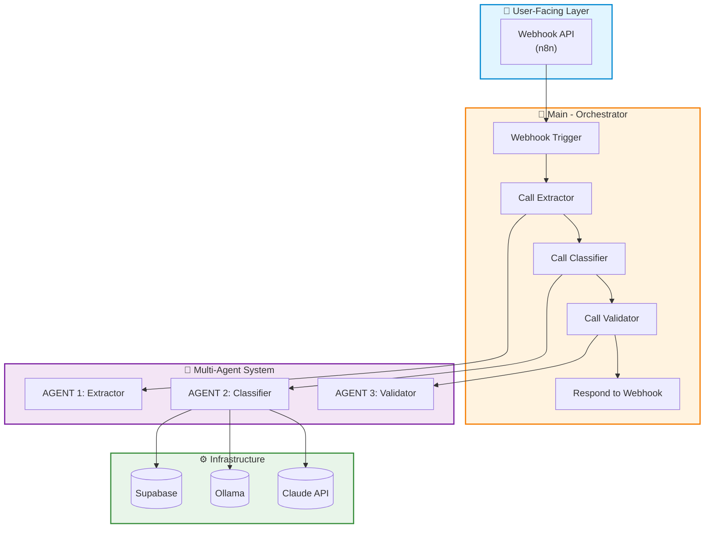
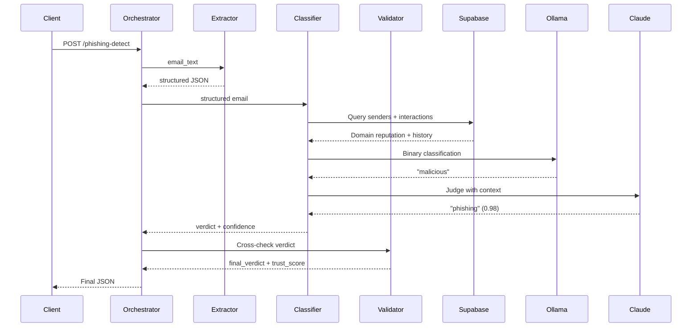
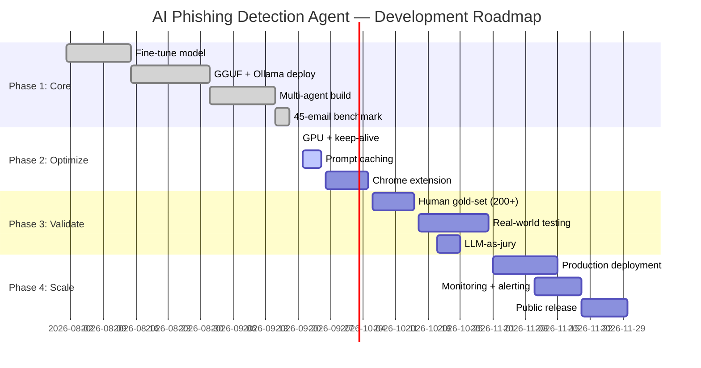

# 🛡️ AI Phishing Detection Agent

**An end-to-end AI system that classifies emails as phishing, BEC, legitimate, or spam — using a fine-tuned Llama 3.2 3B model, a Claude Haiku judge, and RAG-style grounding, orchestrated via a 4-workflow multi-agent architecture in n8n.**

[](https://python.org)
[](https://n8n.io)
[](https://ollama.com)
[](https://supabase.com)
[](https://opensource.org/licenses/MIT)

---

## ⚠️ Read This First

This is a **portfolio-grade demonstration**, not a production security product. Every metric below has boundaries:

- **Small sample size** — 40–45 emails, all synthetic
- **No real-world validation** — tested only on Claude-generated emails
- **No independent human gold-set** — labels assigned by the developer
- **Single-run metrics** — no cross-validation or confidence intervals
- **Hand-crafted adversarial set** — real attackers are more creative

**Read "100%" as** *"performed perfectly on this small, curated benchmark"* — **not** as *"production-ready security."*

A larger, human-verified, real-world eval set is the next step.

---

## 🎯 What Is This?

Traditional phishing filters rely on blacklists and keyword matching. They fail against **Business Email Compromise (BEC)** — where the sender uses a trusted internal domain but makes an unusual request.

This system uses AI that understands **context and intent**, not just keywords.

**Core capabilities:**
- Fine-tuned **Llama 3.2 3B** for binary detection (malicious vs safe)
- **Claude Haiku 4.5** as judge for the final 4-class label
- **RAG-style grounding**: sender reputation + behavioral interaction history
- **Multi-agent architecture**: Extractor → Classifier → Validator → Orchestrator
- **Local inference** via Ollama — zero inference cost, full privacy

---

## 🏆 Key Results

> **All results are from synthetic benchmarks.** See the [Limitations](#-limitations--caveats) section for full context.

### Original Pipeline (Monolithic)

| Benchmark | Result | Caveat |
|-----------|--------|--------|
| 45-email benchmark | **100% exact match** (45/45) | Synthetic data; small sample |
| Prompt injection resistance | **5/5 adversarial cases caught** | Hand-crafted attacks; real adversaries are more creative |

### Multi-Agent Rebuild

| Metric | Result | Caveat |
|--------|--------|--------|
| 40-email benchmark | **92.5% exact match** | Synthetic data; small sample |
| Alert-level accuracy | **97.5%** | Same caveat |
| Recall (threats caught) | **100% — zero false negatives** | On this sample only |
| Precision | 88% | 3 false positives on this sample |
| Flagged for human review | 4 emails | Rule-based flagging |

### System-Wide

| Metric | Result | Caveat |
|--------|--------|--------|
| Binary model accuracy | **100%** | On 100-email synthetic test set; not validated on real emails |
| Cost per email | **~$0.0002** | Claude judge only; varies with email length |
| Latency (optimized) | **~4 seconds** | Measured on 2 test emails; varies with load |
| Training time | **~15 minutes** | Single run on free T4 GPU |

---

## 🏗️ Architecture

### High-Level System



### One Email's Journey



---

## 🛠️ Tech Stack

| Layer | Technology | Status |
|-------|-----------|--------|
| Fine-Tuning | Unsloth + LoRA/QLoRA | ✅ Built |
| Base Model | Llama 3.2 3B | ✅ Built |
| Local Inference | Ollama + GGUF (Q4_K_M) | ✅ Built |
| Judge LLM | Claude Haiku 4.5 | ✅ Built |
| Orchestration | n8n (self-hosted) | ✅ Built |
| Grounding | Supabase (PostgreSQL + REST API) | ✅ Built |
| UI | Streamlit | 🚧 [To be added] |
| Benchmarking | Python + scikit-learn | ✅ Built, scripts pending upload |

---

## 📁 Repository Structure

```
Agentic-AI-Cyber-App/
├── README.md
├── LICENSE                              [To be added]
├── docs/
│   ├── runbook.pdf                      [To be added]
│   ├── architecture.md                  [To be added]
│   └── benchmark-results.png            [To be added]
├── agents/
│   ├── extractor/workflow.json          [To be added]
│   ├── classifier/workflow.json         [To be added]
│   ├── validator/workflow.json          [To be added]
│   └── orchestrator/workflow.json       [To be added]
├── models/
│   ├── training/
│   │   ├── fine_tune_binary.py          [To be added]
│   │   └── training_data_reasoning.csv  [To be added]
│   └── gguf/Modelfile                   [To be added]
├── streamlit/app.py                     [To be added]
├── eval/
│   ├── run_eval_multiagent.py           [To be added]
│   └── hybrid_eval.py                   [To be added]
└── data/schema.sql                      [To be added]
```

> **Note:** Source files are being sanitized (removing credentials, API keys, internal test data) before publishing.

---

# 🗺️ Roadmap

**Current phase:** Phase 2 — Optimization (in progress)
**Last updated:** September 20, 2026



---

## ✅ Phase 1: Core Build (Completed)

**Timeline:** August 1 – September 18, 2026
**Status:** ✅ Complete

| # | Deliverable | Status | Evidence |
|---|-------------|--------|----------|
| 1.1 | Fine-tuned Llama 3.2 3B (binary) | ✅ Done | 100% binary accuracy |
| 1.2 | LoRA + reasoning-based training | ✅ Done | 6 attempts, breakthrough on #4 |
| 1.3 | GGUF conversion + Ollama deployment | ✅ Done | 2 GB Q4_K_M model |
| 1.4 | RAG-style grounding (senders + interactions) | ✅ Done | Supabase tables |
| 1.5 | Multi-agent architecture (4 workflows) | ✅ Done | 23 nodes total |
| 1.6 | 45-email benchmark | ✅ Done | 100% exact match (original) |
| 1.7 | Multi-agent benchmark (40 emails) | ✅ Done | 92.5% exact / 97.5% alert |
| 1.8 | OWASP LLM Top 10 mitigations | ✅ Done | All 10 addressed |

---

## 🚀 Phase 2: Optimization (In Progress)

**Timeline:** September 20 – October 5, 2026
**Status:** 🚧 In progress — 1 of 5 optimizations complete

### Tokenomics (Cost Reduction)

| # | Optimization | Status | Impact | Quality Risk |
|---|--------------|--------|--------|--------------|
| 2.1 | Claude prompt caching | 🚧 Next | 40% cheaper | Zero |
| 2.2 | Compressed output | 📋 Planned | 20% cheaper | Low (measure first) |
| 2.3 | Dynamic model routing | 📋 Planned | 60% on covered emails | Medium (measure first) |
| 2.4 | Semantic caching | 📋 Planned | 30% optional | Medium |

### Latency (Speed)

| # | Optimization | Status | Impact | Quality Risk |
|---|--------------|--------|--------|--------------|
| 2.5 | GPU-accelerated Ollama | ✅ Done | 6x faster | Zero |
| 2.6 | Keep-alive (1h) | ✅ Done | No cold starts | Zero |
| 2.7 | Parallel grounding queries | 📋 Planned | 10% faster | Zero |
| 2.8 | Async judge | 📋 Planned | 80% perceived | Zero |

### LLM Evaluation (Trust)

| # | Improvement | Status | Impact |
|---|-------------|--------|--------|
| 2.9 | Human gold-set (20–30 emails) | 📋 Planned | Ground truth |
| 2.10 | Judge agreement metric | 📋 Planned | Reliability score |
| 2.11 | LLM-as-jury (multi-judge) | 📋 Planned | Reduce bias |
| 2.12 | Active learning loop | 📋 Planned | Continuous improvement |

### User-Facing Product

| # | Deliverable | Status | Impact |
|---|-------------|--------|--------|
| 2.13 | Chrome extension (Gmail) | 📋 Planned | User-facing product |
| 2.14 | Streamlit dashboard | 📋 Planned | Interactive testing |

### Repository Hygiene

| # | Deliverable | Status |
|---|-------------|--------|
| 2.15 | Upload n8n workflow JSONs | 🚧 [To be added] |
| 2.16 | Upload Streamlit app | 🚧 [To be added] |
| 2.17 | Upload Python eval scripts | 🚧 [To be added] |
| 2.18 | Upload Supabase schema SQL | 🚧 [To be added] |
| 2.19 | Sanitize + publish runbook PDF | 🚧 [To be added] |

---

## 🔬 Phase 3: Validation (Planned)

**Timeline:** October 6 – October 31, 2026
**Status:** 📋 Not started

**Goal:** Move from synthetic benchmark to real-world validation.

| # | Milestone | Purpose | Success Criteria |
|---|-----------|---------|------------------|
| 3.1 | Expand benchmark to 200+ emails | Statistical confidence | Human-verified labels |
| 3.2 | Human gold-set evaluation | Independent ground truth | Agreement >90% |
| 3.3 | Real-world testing (anonymized) | Validate on real patterns | Accuracy >85% |
| 3.4 | LLM-as-jury implementation | Reduce judge bias | Majority vote |
| 3.5 | Formal red-team | Test against adversarial tooling | Documented findings |
| 3.6 | Model drift detection | Monitor degradation | Alerting on drift |

---

## 🎯 Phase 4: Production (Planned)

**Timeline:** November 1 – November 30, 2026
**Status:** 📋 Not started

**Goal:** Deploy as a production-ready system.

| # | Milestone | Purpose |
|---|-----------|---------|
| 4.1 | Production deployment (launchd service) | 24/7 availability |
| 4.2 | Monitoring dashboard (Grafana/Streamlit) | Visibility into latency, accuracy |
| 4.3 | Alerting (email, Slack) | Notify on high-trust threats |
| 4.4 | Cost tracking per email | Budget management |
| 4.5 | Documentation for operations | Runbook + SOPs |
| 4.6 | Public release (v1.0) | Portfolio-ready |

---

## 📊 What's Been Built vs Pending

| Category | Built | Pending |
|----------|-------|---------|
| **Model** | ✅ Fine-tuned Llama 3.2 3B | — |
| **Pipeline** | ✅ 4-workflow multi-agent | — |
| **Grounding** | ✅ Supabase (senders + interactions) | — |
| **Benchmark** | ✅ 45-email + 40-email | 🚧 200+ email expansion |
| **Optimization** | 🚧 GPU + keep-alive | 🚧 Caching, routing, evaluation |
| **Product** | — | 🚧 Chrome extension, Streamlit |
| **Code Upload** | — | 🚧 All workflow JSONs, Python scripts |
| **Documentation** | ✅ This README | 🚧 Runbook PDF, architecture.md |

---

## 🎯 Current Focus

**Right now:** Optimization 2 — Claude Prompt Caching

**Why it matters:** 40% cost reduction with zero quality impact. This is a Category A optimization — changes execution path only, not model input.

**Time investment:** ~30 minutes
**Expected outcome:** Cost per email drops from $0.0002 to $0.00012

**Next up after this:** Chrome extension (user-facing product) + Human gold-set (trust foundation).

---

## 📅 Expected Timeline Summary

| Phase | Duration | Key Deliverable |
|-------|----------|-----------------|
| **Phase 1: Core** | ~7 weeks | Working multi-agent system |
| **Phase 2: Optimize** | ~2 weeks | 6x faster, 60% cheaper |
| **Phase 3: Validate** | ~4 weeks | Real-world validated |
| **Phase 4: Production** | ~4 weeks | v1.0 public release |

**Total:** ~17 weeks from start to production (August – November 2026)

---

## ⚠️ Limitations & Caveats

This project is a **portfolio-grade demonstration**, not a production security product.

### Benchmark Limitations

| Limitation | Impact |
|------------|--------|
| **Small sample size** | 40–45 emails. Statistically weak. |
| **Synthetic data** | Generated by Claude. May not reflect real-world patterns. |
| **No independent human gold-set** | Labels assigned by developer. |
| **Single-run results** | No cross-validation. |

### System Limitations

| Limitation | Impact |
|------------|--------|
| **Not validated on real emails** | Real phishing is more varied. |
| **No production monitoring** | Model drift not yet instrumented. |
| **No SPF/DKIM/DMARC checks** | Future enhancement. |
| **Local-only deployment** | Not tested at scale. |

### Security Limitations

| Limitation | Impact |
|------------|--------|
| **Prompt injection set is small** | 5 hand-crafted attacks. |
| **No formal red-team** | Not tested against professional tooling. |
| **No differential privacy** | Training data could theoretically be memorized. |

**Read "100%" as:** *"Performed perfectly on a small, curated, synthetic benchmark."*

---

## 🤝 Contributing

This is a personal portfolio project, but feedback is welcome. Open an issue or connect on [LinkedIn](https://www.linkedin.com/in/shivoymalhotra/).

---

## 🙏 Acknowledgments

- **Unsloth** — accessible fine-tuning on free GPUs
- **Anthropic** — Claude Haiku 4.5
- **Ollama** — local inference
- **n8n** — visual orchestration
- **Supabase** — grounding infrastructure

---

**Built by [Shivoy Malhotra](https://shivoy-portfolio.vercel.app/)** — Technical Program Manager | AI Security & Cloud Delivery

*Last updated: September 20, 2026*
