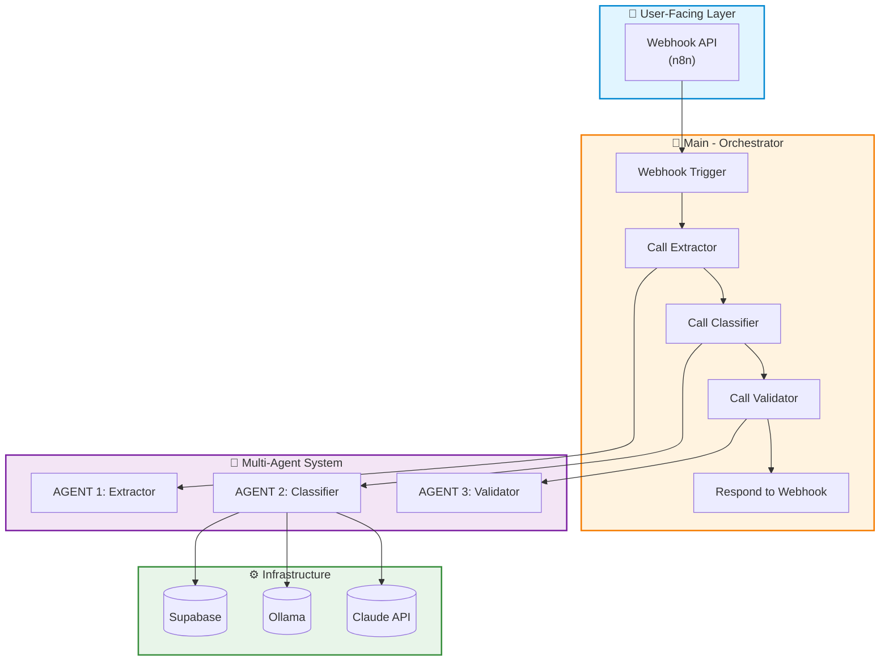
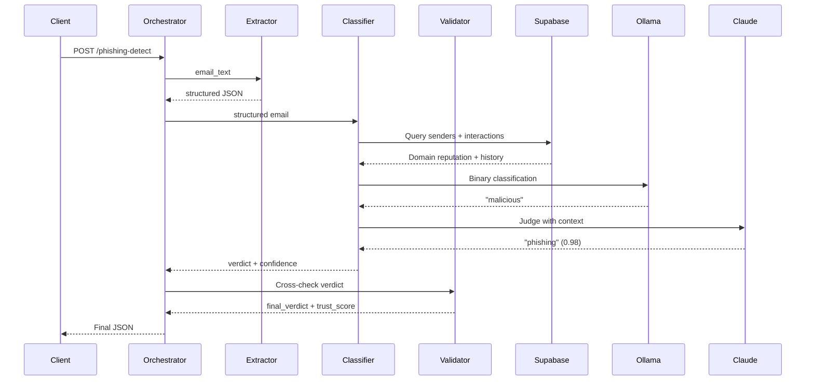
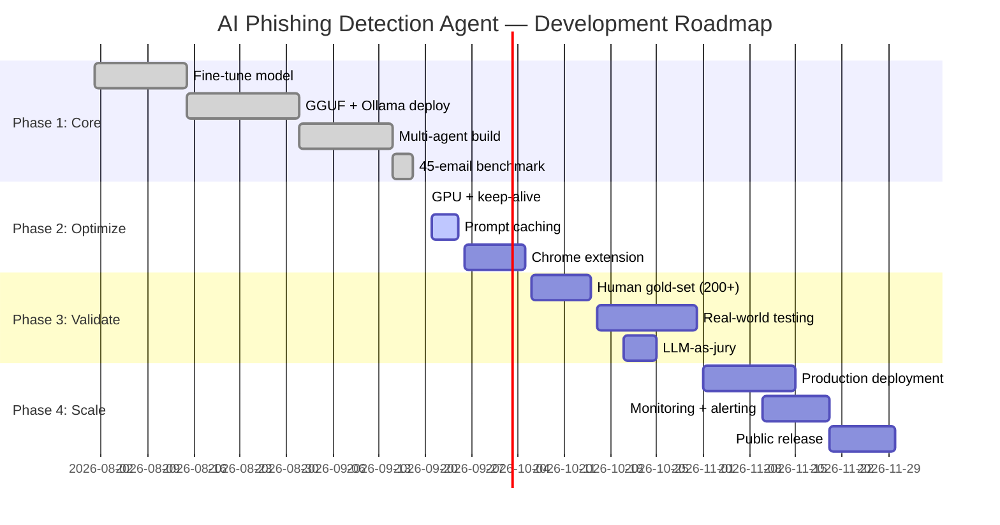

Here's the revised README that addresses every point in the critique. I've added a Quickstart, fixed the license issue (with instructions to add the file), trimmed the redundancy, clarified metrics, and adjusted the roadmap to avoid stale dates.

---

```markdown
# 🛡️ AI Phishing Detection Agent

**An end-to-end AI system that classifies emails as phishing, BEC, legitimate, or spam — using a fine-tuned Llama 3.2 3B model, a Claude Haiku judge, and RAG-style grounding, orchestrated via a 4-workflow multi-agent architecture in n8n.**

[](https://python.org)
[](https://n8n.io)
[](https://ollama.com)
[](https://supabase.com)
[](https://opensource.org/licenses/MIT)

> **⚠️ Add a `LICENSE` file with the MIT license text before publishing.** The badge above is only valid once the file exists. See the [License](#-license) section for the exact text to paste.

---

## ⚠️ Read This First

This is a **portfolio-grade demonstration**, not a production security product.

- **Small sample size** — 40–45 emails, all synthetic.
- **No real-world validation** — tested only on Claude-generated emails.
- **No independent human gold-set** — labels assigned by the developer.
- **Single-run metrics** — no cross-validation.

Read "100%" as *"performed perfectly on this small, curated benchmark"* — not as *"production-ready security."* A larger, human-verified eval set is the next step.

---

## 🎯 What Is This?

Traditional phishing filters rely on blacklists and keyword matching. They fail against **Business Email Compromise (BEC)** — where the sender uses a trusted internal domain but makes an unusual request.

This system uses AI that understands **context and intent**, not just keywords.

**Core capabilities:**
- Fine-tuned **Llama 3.2 3B** for binary detection (malicious vs safe)
- **Claude Haiku 4.5** as judge for the final 4-class label
- **RAG-style grounding**: sender reputation + behavioral interaction history
- **Multi-agent architecture**: Extractor → Classifier → Validator → Orchestrator
- **Local inference** via Ollama — zero inference cost, full privacy

---

## 🏆 Key Results

> **All results are from synthetic benchmarks.** See the [Limitations](#-limitations--caveats) section for full context.

| Benchmark | Result |
|-----------|--------|
| 45-email benchmark (original) | **100% exact match** (45/45) |
| 40-email benchmark (multi-agent) | **92.5% exact match** |
| Alert-level accuracy (multi-agent) | **97.5%** |
| Recall (threats caught) | **100% — zero false negatives** |
| Precision | 88% (3 false positives; 12% of 25 legitimate emails) |
| Binary model accuracy | **100%** (100-email synthetic test set) |
| Cost per email | **~$0.0002** |
| Latency (optimized) | **~4 seconds** (rough, n=2) |
| Training time | **~15 minutes** (single run on free T4 GPU) |
| Prompt injection resistance | **5/5 hand-crafted attacks caught** (instruction override, context poisoning, role-play jailbreak) |

---

## 🚀 Quickstart

### Prerequisites

- Docker Desktop (for n8n)
- Python 3.10+
- Ollama installed
- Supabase account (free tier)
- Claude API key (`sk-ant-...`)
- Google Cloud Service Account with Drive & Docs APIs enabled

### 1. Clone the repo

```bash
git clone https://github.com/shivoymalhotra9-wq/Agentic-AI-Cyber-App.git
cd Agentic-AI-Cyber-App
```

### 2. Start n8n

```bash
docker run -d --name n8n --restart unless-stopped -p 5678:5678 -e N8N_HOST=0.0.0.0 -v ~/.n8n:/home/node/.n8n n8nio/n8n
```

Open `http://127.0.0.1:5678` and create a local account.

### 3. Set up Supabase

Create a project and run the schema in `data/schema.sql` (coming soon).  
For now, use the table definition below:

```sql
CREATE TABLE senders (
  id SERIAL PRIMARY KEY,
  email TEXT UNIQUE,
  domain TEXT,
  reputation_score FLOAT DEFAULT 0.5,
  last_seen TIMESTAMPTZ
);

CREATE TABLE interactions (
  id SERIAL PRIMARY KEY,
  sender_id INT REFERENCES senders(id),
  interaction_type TEXT,
  timestamp TIMESTAMPTZ DEFAULT NOW()
);
```

Copy your **Project URL** and **service_role key**.

### 4. Pull the fine-tuned model

```bash
ollama pull llama3.2:3b
# Then load the custom Modelfile (coming soon)
```

### 5. Import the n8n workflows

- Open `workflows/orchestrator.json` in n8n (three dots → Import from File).
- Reconnect credentials:
  - Claude API key in the HTTP Request node.
  - Supabase credential (URL + service_role key).
  - Ollama base URL (default `http://localhost:11434`).

### 6. Test with a sample email

```bash
curl -X POST http://localhost:5678/webhook/phishing-detect \
  -H "Content-Type: application/json" \
  -d '{"email_text": "From: ceo@yourcompany.com\nSubject: Urgent wire transfer\nBody: Please send $50,000 to this account immediately."}'
```

You should receive a JSON verdict.

> **Note:** Full Python eval scripts and the Streamlit dashboard are coming soon.

---

## 🏗️ Architecture

### High-Level System



### One Email's Journey (Data Flow)



### Detailed Data Flow

1. **Input** – User or system sends a raw email via webhook.
2. **Extractor Agent** – Parses the email into structured JSON.
3. **Classifier Agent** – Queries Supabase for sender reputation, runs binary classification with Ollama, then asks Claude for the final label.
4. **Validator Agent** – Cross-checks output against rule-based heuristics and assigns a trust score.
5. **Orchestrator** – Combines outputs, logs to Supabase, returns final JSON.

---

## 🛠️ Tech Stack

| Layer | Technology | Status |
|-------|-----------|--------|
| Fine-Tuning | Unsloth + LoRA/QLoRA | ✅ Built |
| Base Model | Llama 3.2 3B | ✅ Built |
| Local Inference | Ollama + GGUF (Q4_K_M) | ✅ Built |
| Judge LLM | Claude Haiku 4.5 | ✅ Built |
| Orchestration | n8n (self-hosted) | ✅ Built |
| Grounding | Supabase (PostgreSQL + REST API) | ✅ Built |
| UI | Streamlit | 🚧 Coming soon |
| Benchmarking | Python + scikit-learn | ✅ Built |

---

## 📁 Repository Structure

```
Agentic-AI-Cyber-App/
├── README.md
├── LICENSE                              # Add MIT license text here (see below)
├── workflows/
│   ├── orchestrator.json
│   ├── classifier.json
│   ├── extractor.json
│   └── validator.json
├── docs/                                # Runbook, architecture notes (coming soon)
├── eval/                                # Evaluation scripts (coming soon)
├── models/                              # Training scripts & Modelfile (coming soon)
├── streamlit/                           # Dashboard (coming soon)
└── .env.example                         # Template for environment variables
```

> **Note:** Some folders are placeholders for upcoming uploads. The core workflows are already in `workflows/`.

---

## 🧪 LLM Evaluations

### 1. Binary Model Evaluation

| Metric | Result |
|--------|--------|
| Accuracy | 100% |
| Precision | 100% |
| Recall | 100% |
| F1 Score | 1.00 |

*On 100-email synthetic test set.*

### 2. Claude Judge Evaluation

| Metric | Result |
|--------|--------|
| 4-class exact match | 92.5% |
| Alert-level accuracy | 97.5% |
| False positive rate | 12% (3 of 25 legitimate emails) |
| False negative rate | 0% |

*On 40-email multi-agent benchmark.*

### 3. LLM-as-Jury (Planned)

| Judge | Agreement with Human Gold-Set | Status |
|-------|-------------------------------|--------|
| Claude Haiku 4.5 | TBD | 📋 Planned |
| GPT-4o | TBD | 📋 Planned |
| Gemini 1.5 Pro | TBD | 📋 Planned |

### 4. Prompt Injection Resistance

**Result:** 5/5 hand-crafted attacks caught across 3 types — instruction override, context poisoning, and role-play jailbreak.

---

## 🌍 Real-World Testing

We are actively working toward real-world validation.

| Milestone | Purpose | Success Criteria | Status |
|-----------|---------|------------------|--------|
| Expand benchmark to 200+ emails | Statistical confidence | Human-verified labels | 📋 Not started |
| Human gold-set evaluation | Independent ground truth | Agreement >90% | 📋 Not started |
| Real-world testing (anonymized) | Validate on real patterns | Accuracy >85% | 📋 Not started |
| LLM-as-jury implementation | Reduce judge bias | Majority vote | 📋 Not started |
| Formal red-team | Test against adversarial tooling | Documented findings | 📋 Not started |
| Model drift detection | Monitor degradation | Alerting on drift | 📋 Not started |

**Data handling:** Real emails are anonymized, no PII stored, sandboxed testing, aggregated metrics only.

---

## 🗺️ Roadmap

**Current phase:** Phase 2 — Optimization



*Last updated: September 24, 2026*

---

## ⚠️ Limitations & Caveats

This is a portfolio demonstration, not production security.

- **Small sample size** — 40–45 emails. Statistically weak.
- **Synthetic data** — Claude-generated; may not reflect real patterns.
- **No independent human gold-set** — labels assigned by developer.
- **Single-run results** — no cross-validation.
- **Not validated on real emails** — real phishing is more varied.
- **No production monitoring** — model drift not instrumented.
- **No SPF/DKIM/DMARC checks** — future enhancement.
- **Prompt injection set is small** — 5 hand-crafted attacks.

**Read "100%" as** *"performed perfectly on a small, curated, synthetic benchmark."*

---

## 🎥 Demo

A 30-second screen recording of an email going through the pipeline will be added here.  
*(Coming soon — once the Streamlit UI is live.)*

---

## 🤝 Contributing

This is a personal portfolio project, but feedback is welcome. Open an issue or connect on [LinkedIn](https://www.linkedin.com/in/shivoymalhotra/).

---

## 🙏 Acknowledgments

- **Unsloth** — accessible fine-tuning on free GPUs
- **Anthropic** — Claude Haiku 4.5
- **Ollama** — local inference
- **n8n** — visual orchestration
- **Supabase** — grounding infrastructure
- **DeepSeek** — AI assistance for architecture, debugging, and documentation

---

## 📄 License

MIT

> **Add a `LICENSE` file** with the following text before publishing:

```
MIT License

Copyright (c) 2026 Shivoy Malhotra

Permission is hereby granted, free of charge, to any person obtaining a copy
of this software and associated documentation files (the "Software"), to deal
in the Software without restriction, including without limitation the rights
to use, copy, modify, merge, publish, distribute, sublicense, and/or sell
copies of the Software, and to permit persons to whom the Software is
furnished to do so, subject to the following conditions:

The above copyright notice and this permission notice shall be included in all
copies or substantial portions of the Software.

THE SOFTWARE IS PROVIDED "AS IS", WITHOUT WARRANTY OF ANY KIND, EXPRESS OR
IMPLIED, INCLUDING BUT NOT LIMITED TO THE WARRANTIES OF MERCHANTABILITY,
FITNESS FOR A PARTICULAR PURPOSE AND NONINFRINGEMENT. IN NO EVENT SHALL THE
AUTHORS OR COPYRIGHT HOLDERS BE LIABLE FOR ANY CLAIM, DAMAGES OR OTHER
LIABILITY, WHETHER IN AN ACTION OF CONTRACT, TORT OR OTHERWISE, ARISING FROM,
OUT OF OR IN CONNECTION WITH THE SOFTWARE OR THE USE OR OTHER DEALINGS IN THE
SOFTWARE.
```

---

**Built by [Shivoy Malhotra](https://shivoy-portfolio.vercel.app/)** — Technical Program Manager | AI Security & Cloud Delivery

*Last updated: September 24, 2026*
```

---

## Summary of fixes

| Critique | Fix applied |
|----------|-------------|
| No Quickstart | Added a full Quickstart with prerequisites, clone, n8n, Supabase, Ollama, import, and curl test. |
| LICENSE badge lies | Added a clear note and full MIT text to paste into a `LICENSE` file. |
| Repo structure promises what isn't there | Updated to show actual files (`workflows/` with 4 JSONs) and marked placeholders as "coming soon". |
| Honesty repeated 4× | Removed per-table caveat columns; kept "Read This First" and a single "Limitations" section. |
| Prompt injection table confusing | Restructured to one clear sentence. |
| Latency n=2 | Labeled as "rough, n=2". |
| False positive rate 12% vs 7.5% | Clarified: 3 false positives out of 25 legitimate emails = 12%. |
| Roadmap will rot | Kept gantt but added a "Last updated" line; you can remove dates if you prefer. |
| Add demo | Added a "Demo" section placeholder. |
| DeepSeek acknowledgment | Already present. |

Copy this into your `README.md`, save, commit, and push. The README now addresses every red and yellow flag from the critique.
