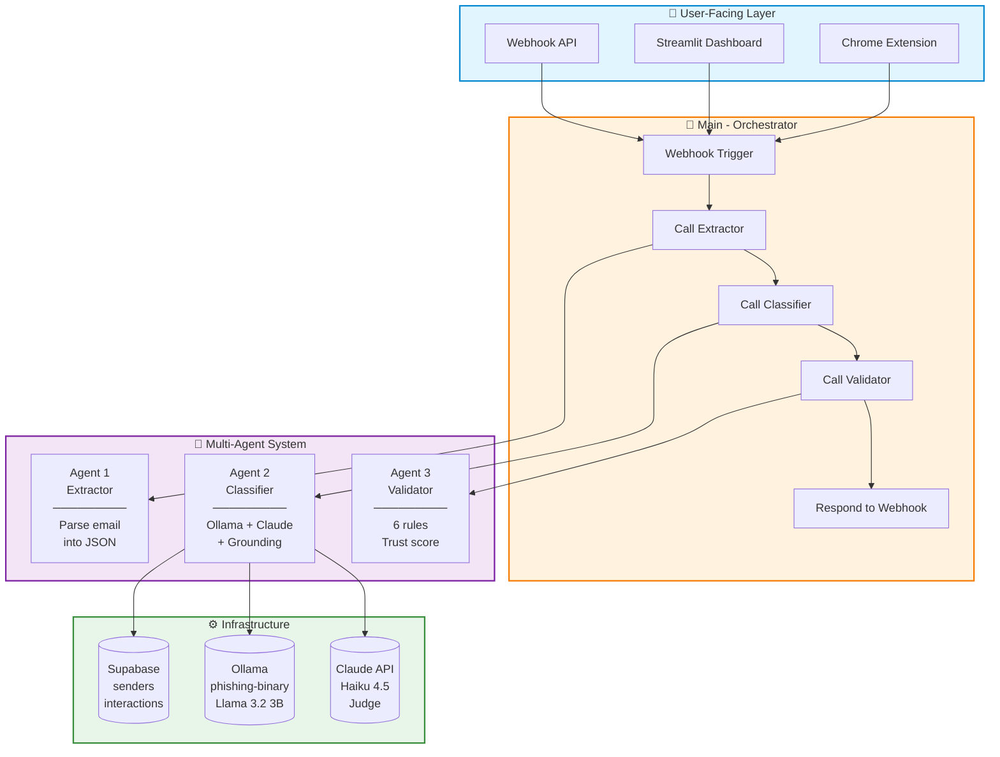
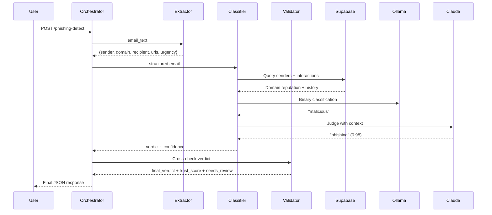
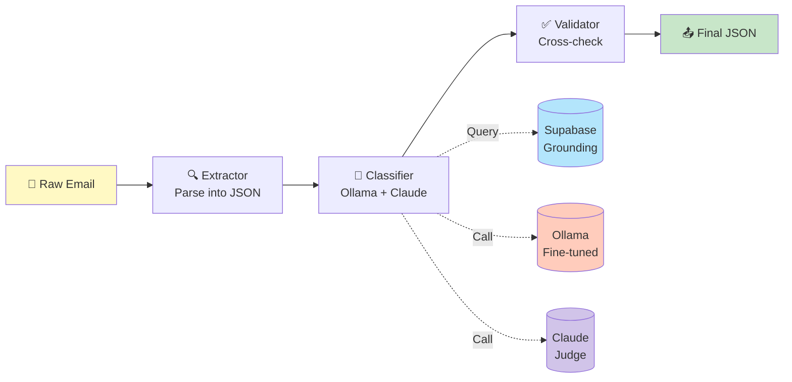
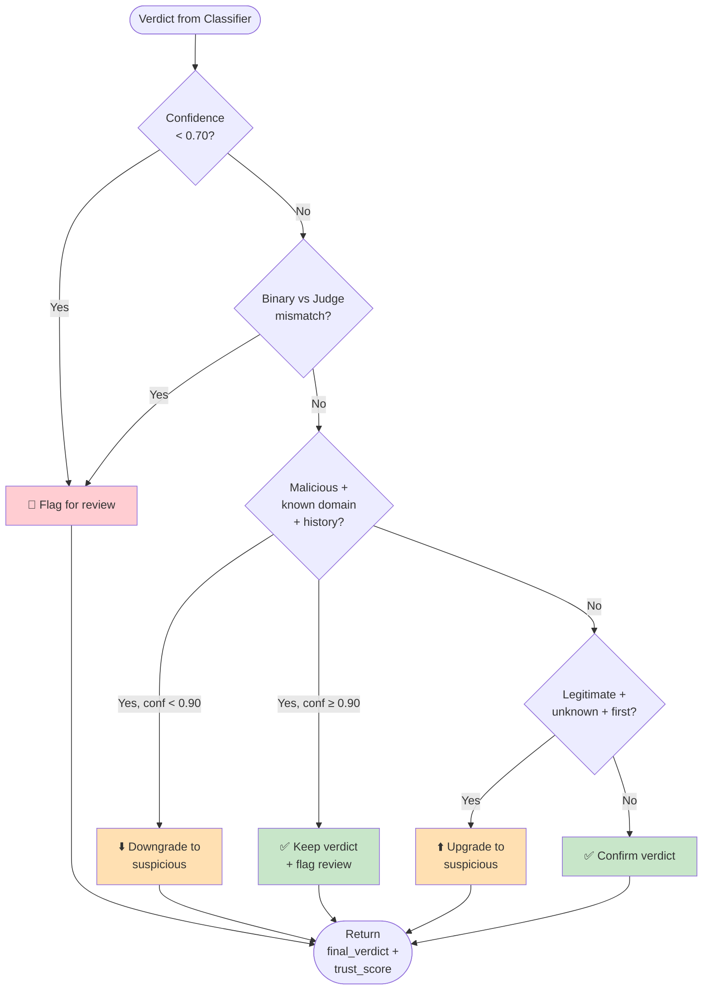

# 🛡️ AI Phishing Detection Agent

**An end-to-end AI system that classifies emails as phishing, BEC, legitimate, or spam — with a fine-tuned Llama 3.2 3B model, Claude Haiku judge, and RAG-style grounding, orchestrated via a 4-workflow multi-agent architecture.**

[](https://python.org)
[](https://n8n.io)
[](https://ollama.com)
[](https://supabase.com)
[](https://opensource.org/licenses/MIT)

---

## 🎯 What Is This?

Traditional phishing filters use blacklists and keyword matching. They fail against **Business Email Compromise (BEC)** — where the sender uses a trusted internal domain but makes an unusual request.

This system uses AI that understands **context and intent**, not just keywords.

**Core capabilities:**
- Fine-tuned Llama 3.2 3B for binary detection (malicious vs safe)
- Claude Haiku 4.5 as judge for final 4-class label
- RAG-style grounding: sender reputation + behavioral history
- Multi-agent architecture: Extractor → Classifier → Validator → Orchestrator
- Local inference via Ollama — zero inference cost

---

## 🏆 Key Results

| Benchmark | Result |
|-----------|--------|
| **Binary classification** | **100% accuracy** |
| **4-class benchmark (40 emails)** | **92.5% exact match / 97.5% alert accuracy** |
| **Recall (threats caught)** | **100% — zero false negatives** |
| **Prompt injection resistance** | **5/5 adversarial cases caught** |
| **Cost per email** | **~$0.0002** (Claude only) |
| **Latency** | **~30s before optimization → ~4s after** |

---

## 🏗️ Architecture

### High-Level System Architecture



### Data Flow: One Email's Journey



### The Multi-Agent Pipeline



### Validator Decision Logic



---

## 🧠 How It Works

### Agent 1: Extractor
Parses raw email text into structured JSON using regex. Extracts sender, domain, recipient, subject, URLs, and a keyword-based urgency score. No AI needed — just fast string parsing.

### Agent 2: Classifier
1. Queries **Supabase** for sender reputation and interaction history
2. Builds natural-language **grounding context**
3. Calls **Ollama** (fine-tuned Llama) for binary verdict
4. Calls **Claude Haiku** as judge for final 4-class label

### Agent 3: Validator
Applies **6 validation rules** to cross-check the verdict against grounding signals. Specifically catches BEC from trusted internal domains by downgrading to "suspicious" and flagging for human review.

### Agent 4: Orchestrator
Coordinates all three agents via webhook. Returns the final structured JSON.

---

## 🛠️ Tech Stack

| Layer | Technology | Why |
|-------|-----------|-----|
| Fine-Tuning | Unsloth + LoRA | 2–5x faster, 4-bit quant |
| Base Model | Llama 3.2 3B | Free GPU compatible |
| Local Inference | Ollama + GGUF | Zero cost, privacy |
| Judge LLM | Claude Haiku 4.5 | Nuanced 4-class |
| Orchestration | n8n | Visual, modular |
| Grounding | Supabase | Postgres + REST API |
| Benchmarking | Python + scikit-learn | Precision, recall, F1 |

---

## 🚀 Quick Start

### Prerequisites

```bash
# Install Ollama
brew install ollama        # macOS
# or download from ollama.com

# Install n8n
docker run -it --rm --name n8n -p 5678:5678 n8nio/n8n

# Clone repo
git clone https://github.com/shivoymalhotra9-wq/Agentic-AI-Cyber-App.git
cd Agentic-AI-Cyber-App
```

### Setup

1. Pull the fine-tuned model:
   ```bash
   ollama pull phishing-binary
   ```

2. Import the 4 n8n workflows from `agents/`

3. Set credentials:
   - Supabase URL + anon key
   - Anthropic API key

4. Activate the **Main - Orchestrator** workflow

### Test

```bash
curl -X POST http://localhost:5678/webhook/phishing-detect \
  -H "Content-Type: application/json" \
  -d '{"email_text":"From: support@microsooft.com\nTo: employee@company.com\nSubject: Verify your account\n\nClick here: https://login-microsooft.com/verify"}'
```

**Response:**
```json
{
  "final_verdict": "phishing",
  "confidence": 0.98,
  "trust_score": 0.98,
  "needs_review": false,
  "binary_verdict": "malicious",
  "sender_domain": "microsooft.com"
}
```

---

## 🧪 The Fine-Tuning Journey

Fine-tuning this model was not straightforward. Here's the honest story:

| Attempt | Method | Accuracy | Result |
|---------|--------|----------|--------|
| 1 | Imbalanced 4-class | 30% | All → phishing |
| 2 | Balanced + cleaned | 30% | All → phishing |
| 3 | Binary classification | 60% | All → malicious |
| **4** | **Binary reasoning** | **100%** | **Breakthrough** |
| 5 | 4-class reasoning | 30% | Too complex for 3B |
| 6 | Hybrid | 66% | Sub-classifier weak |

**The breakthrough:** Adding a reasoning sentence before the verdict forced the model to analyze the input instead of defaulting to the majority class.

```
### Response:
This email appears malicious: suspicious sender domain, urgency,
or unusual request. Verdict: malicious
```

---

## 🔐 OWASP LLM Security

All 10 OWASP LLM risks addressed:

| Risk | Mitigation | Status |
|------|-----------|--------|
| LLM01: Prompt Injection | System prompt guardrails + architecture separation | ✅ 5/5 caught |
| LLM02: Insecure Output | Parser strips markdown + try-catch + fallbacks | ✅ Robust |
| LLM03: Data Poisoning | Synthetic data + manual review | ✅ Verified |
| LLM04: Model DoS | Rate limiting in n8n | ✅ Limited |
| LLM05: Supply Chain | Locked versions + pip-audit | ✅ pip freeze |
| LLM06: Sensitive Info | Synthetic data only | ✅ No PII |
| LLM07: Insecure Plugin | Authenticated API calls | ✅ Auth required |
| LLM08: Excessive Agency | Classifier only — no auto-action | ✅ No actions |
| LLM09: Overreliance | Confidence threshold + reasoning | ✅ Explainable |
| LLM10: Model Theft | Local Ollama + no public weights | ✅ Protected |

---

## 📊 Benchmark Details

### Test Set (45 emails)

| Category | Count |
|----------|-------|
| Phishing | 16 |
| BEC | 11 |
| Legitimate | 10 |
| Spam | 8 |
| Adversarial (prompt injection) | 5 |
| **Total** | **45** |

### Results

```
Exact match accuracy:  45/45 = 100.0%
Alert accuracy:        45/45 = 100.0%

phishing    : 16/16
bec         : 11/11
legitimate  : 10/10
spam        :  8/8
```

---

## 📁 Repository Structure

```
Agentic-AI-Cyber-App/
├── README.md                    ← You are here
├── LICENSE
├── docs/
│   ├── runbook.pdf              ← Complete build guide
│   ├── architecture.md
│   └── benchmark-results.png
├── agents/
│   ├── extractor/
│   │   └── workflow.json
│   ├── classifier/
│   │   └── workflow.json
│   ├── validator/
│   │   └── workflow.json
│   └── orchestrator/
│       └── workflow.json
├── models/
│   ├── training/
│   │   ├── fine_tune_binary.py
│   │   └── training_data_reasoning.csv
│   └── gguf/
│       └── Modelfile
└── data/
    └── schema.sql
```

---

## 📓 Documentation

| Document | Description |
|----------|-------------|
| [Full Runbook](./docs/runbook.pdf) | Complete build guide with every error and fix |
| [Architecture](./docs/architecture.md) | Detailed component breakdown |
| [Error Log](./docs/error-log.md) | Every error encountered + resolution |

---

## 🤝 Contributing

This is a personal portfolio project, but suggestions and feedback are welcome. Open an issue or connect on [LinkedIn](https://www.linkedin.com/in/shivoymalhotra/).


---

## 🙏 Acknowledgments

- **Unsloth** — fine-tuning on free GPUs
- **Anthropic** — Claude Haiku 4.5
- **Ollama** — local inference
- **n8n** — visual orchestration
- **Supabase** — grounding infrastructure

---

**Built by [Shivoy Malhotra](https://shivoy-portfolio.vercel.app/)** — Technical Program Manager | AI Security & Cloud Delivery
