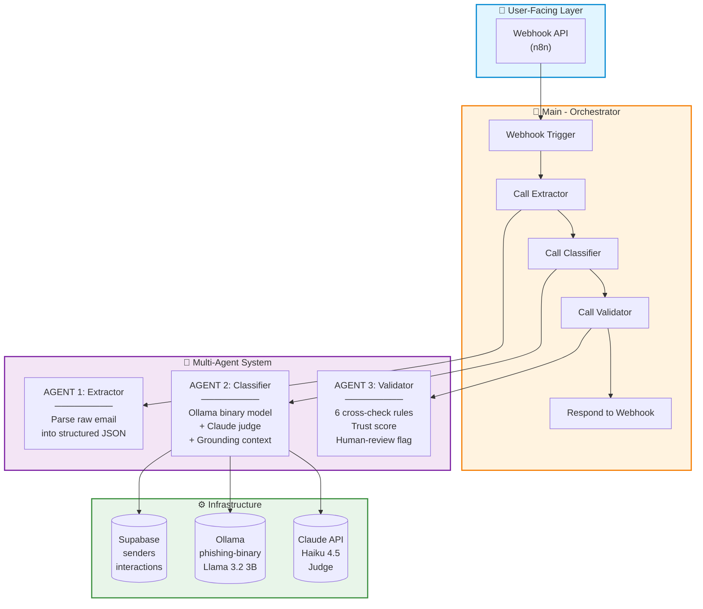
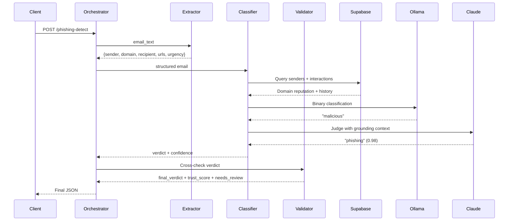
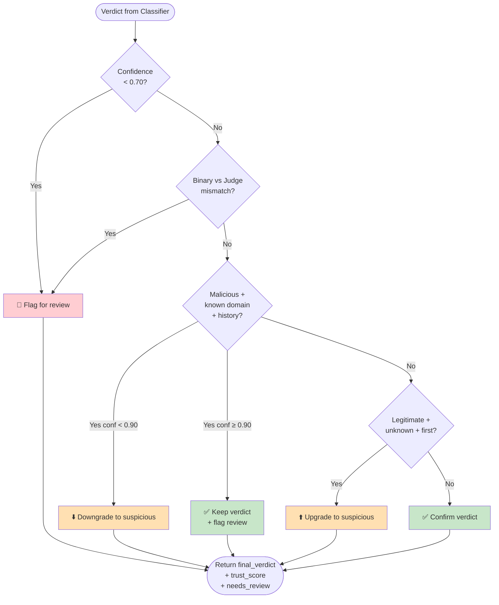

# 🛡️ AI Phishing Detection Agent

**An end-to-end AI system that classifies emails as phishing, BEC, legitimate, or spam — using a fine-tuned Llama 3.2 3B model, a Claude Haiku judge, and RAG-style grounding, orchestrated via a 4-workflow multi-agent architecture in n8n.**

[](https://python.org)
[](https://n8n.io)
[](https://ollama.com)
[](https://supabase.com)
[](https://opensource.org/licenses/MIT)

---

## 🎯 What Is This?

Traditional phishing filters rely on blacklists and keyword matching. They fail against **Business Email Compromise (BEC)** — where the sender uses a trusted internal domain but makes an unusual request.

This system uses AI that understands **context and intent**, not just keywords.

**Core capabilities:**
- Fine-tuned **Llama 3.2 3B** for binary detection (malicious vs safe)
- **Claude Haiku 4.5** as judge for the final 4-class label
- **RAG-style grounding**: sender reputation + behavioral interaction history
- **Multi-agent architecture**: Extractor → Classifier → Validator → Orchestrator
- **Local inference** via Ollama — zero inference cost, full privacy

---

## 🏆 Key Results

### Original Pipeline (Monolithic)

| Benchmark | Result |
|-----------|--------|
| 45-email benchmark | **100% exact match** (45/45) |
| Prompt injection resistance | **5/5 adversarial cases caught** |

### Multi-Agent Rebuild

| Benchmark | Result |
|-----------|--------|
| 40-email benchmark | **92.5% exact match** (37/40) |
| Alert-level accuracy | **97.5%** (39/40) |
| Recall (threats caught) | **100% — zero false negatives** |
| Precision | 88% (22/25) |
| Flagged for human review | 4 emails |
| False positives | 3 (all safe emails flagged) |
| False negatives | **0** |

### System-Wide

| Metric | Result |
|--------|--------|
| Binary model accuracy (fine-tuned Llama) | **100%** |
| Cost per email | **~$0.0002** (Claude judge only; rest is free) |
| Latency | **~30 seconds** per email (Ollama on CPU) |
| Training time | **~15 minutes** on free T4 GPU |

> **Honest note:** Both benchmarks are small (40–45 emails). A larger real-world evaluation is planned. The 100% figures reflect performance on a carefully labeled synthetic benchmark — not a claim of production-grade accuracy.

---

## 🏗️ Architecture

### High-Level System



### One Email's Journey



### Validator Decision Logic



---

## 🧠 How It Works

### Agent 1: Extractor
Parses raw email text into structured JSON using regex. Extracts `sender`, `sender_domain`, `recipient`, `subject`, `body`, `urls`, and a keyword-based `urgency_score`. No AI — just fast, deterministic parsing.

### Agent 2: Classifier
1. Queries **Supabase** for sender reputation (`senders` table) and behavioral history (`interactions` table)
2. Builds a natural-language **grounding context**
3. Calls **Ollama** (fine-tuned Llama) for a binary verdict (`malicious` / `safe`)
4. Calls **Claude Haiku 4.5** as judge for the final 4-class label

### Agent 3: Validator
Applies **6 validation rules** to cross-check the verdict against grounding signals:
- Low confidence → flag
- Binary/judge mismatch → flag
- Malicious from known domain with history + low confidence → **downgrade to suspicious** (BEC catch)
- Legitimate from unknown domain + first contact → upgrade to suspicious
- High-confidence malicious from unknown domain → confirm
- High-confidence legitimate from known domain → confirm

### Agent 4: Orchestrator
Coordinates all three agents via webhook. Returns the final structured JSON.

---

## 🛠️ Tech Stack

| Layer | Technology | Purpose |
|-------|-----------|---------|
| Fine-Tuning | Unsloth + LoRA/QLoRA | 2–5x faster training, 4-bit quantization |
| Base Model | Llama 3.2 3B | Small enough for free GPU, capable enough for nuance |
| Local Inference | Ollama + GGUF (Q4_K_M) | Zero-cost, privacy-preserving inference |
| Judge LLM | Claude Haiku 4.5 | Nuanced 4-class classification |
| Orchestration | n8n (self-hosted) | Visual workflow automation |
| Grounding | Supabase (PostgreSQL + REST API) | Sender reputation + interaction history |
| Benchmarking | Python + scikit-learn | Precision, recall, F1, confusion matrix |

---

## 🚀 Quick Start

### Prerequisites

```bash
# Install Ollama
brew install ollama                # macOS
# or download from ollama.com

# Start n8n via Docker
docker run -it --rm --name n8n -p 5678:5678 n8nio/n8n

# Clone this repo
git clone https://github.com/shivoymalhotra9-wq/Agentic-AI-Cyber-App.git
cd Agentic-AI-Cyber-App
```

### Setup

1. **Pull the fine-tuned model:**
   ```bash
   ollama pull phishing-binary
   ollama list
   ```

2. **Import the 4 n8n workflows** from `agents/`:
   - `Agent - Extractor`
   - `Agent - Classifier`
   - `Agent - Validator`
   - `Main - Orchestrator`

3. **Set credentials** in n8n:
   - Supabase URL + anon key
   - Anthropic API key

4. **Activate** the `Main - Orchestrator` workflow.

### Test the Pipeline

```bash
curl -X POST http://localhost:5678/webhook/phishing-detect \
  -H "Content-Type: application/json" \
  -d '{"email_text":"From: support@microsooft.com\nTo: employee@company.com\nSubject: Verify your account\n\nClick here: https://login-microsooft.com/verify"}'
```

**Expected response:**
```json
{
  "final_verdict": "phishing",
  "confidence": 0.98,
  "trust_score": 0.98,
  "needs_review": false,
  "binary_verdict": "malicious",
  "sender_domain": "microsooft.com"
}
```

---

## 🧪 The Fine-Tuning Journey

Fine-tuning this model was not straightforward. Here's the honest story of all six attempts:

| Attempt | Method | Accuracy | Result |
|---------|--------|----------|--------|
| 1 | Imbalanced 4-class | 30% | All → phishing |
| 2 | Balanced + cleaned data | 30% | All → phishing |
| 3 | Binary classification | 60% | All → malicious |
| **4** | **Binary + reasoning format** | **100%** | **Breakthrough** |
| 5 | 4-class reasoning | 30% | Too complex for 3B |
| 6 | Hybrid (binary + Ollama sub-classifier) | 66% | Sub-classifier weak |

**The breakthrough:** Adding a reasoning sentence before the verdict forced the model to analyze the input instead of defaulting to the majority class.

```
### Instruction:
Classify this email as malicious or safe.

### Input:
From: it-helpdesk@c0mpany.com Subject: Mandatory VPN Update

### Response:
This email appears malicious: suspicious sender domain, urgency,
or unusual request. Verdict: malicious
```

**Training configuration:**
| Parameter | Value |
|-----------|-------|
| Base model | Llama 3.2 3B (4-bit) |
| LoRA rank | 64 |
| Max steps | 200 |
| Learning rate | 2e-4 |
| Training examples | 419 |
| Training time | ~15 minutes on free T4 GPU |

---

## 🧪 Testing & Validation Methodology

### Test Set Composition

| Category | Count | What It Tests |
|----------|-------|---------------|
| Phishing | 16 | Credential harvesting, typosquatting, homoglyphs |
| BEC | 11 | Wire transfers, gift cards, payroll changes |
| Legitimate | 10 | Internal emails, vendor invoices, benefits |
| Spam | 8 | Promotional, marketing |
| Adversarial (prompt injection) | 5 | Attack attempts against the LLM |
| **Total** | **45** | |

### Metrics Used

| Metric | Definition |
|--------|-----------|
| **Exact match** | Prediction == true label (strict 4-class) |
| **Alert accuracy** | Correctly identified threat vs safe |
| **Recall** | Of actual threats, how many did we catch? |
| **Precision** | Of alerts raised, how many were real? |
| **F1** | Harmonic mean of precision and recall |

### Benchmark 1: Original Monolithic Pipeline (45 emails)

| Metric | Result |
|--------|--------|
| Exact match | **100%** (45/45) |
| Alert accuracy | **100%** (45/45) |
| Prompt injection | **5/5 caught** |

### Benchmark 2: Multi-Agent Rebuild (40 emails)

| Metric | Original | Multi-Agent |
|--------|----------|-------------|
| Exact match | 100.00% | **92.50%** |
| Alert accuracy | 100.00% | **97.50%** |
| Recall | 100% | **100%** |
| Precision | 1.0000 | 0.8800 |
| Flagged for review | 0 | 4 |

**The 3 errors were all false positives** — safe emails flagged as phishing. **Zero false negatives** — no threats were missed.

### Ablation Study (40 emails, 3 variants)

| Variant | Grounding | Accuracy | Precision | Recall |
|---------|-----------|----------|-----------|--------|
| A | None | 83.33% | 73.68% | 100% |
| B | Static only | **97.5%** | **95.65%** | **100%** |
| C | Static + Behavioral | 92.5% | 88.00% | 100% |

**Key finding:** Static grounding (sender domain reputation) was the most impactful signal — improving precision from 73.7% to 95.7% while maintaining 100% recall.

---

## 🔐 OWASP LLM Security

All 10 OWASP LLM risks addressed:

| Risk | Mitigation | Test Result |
|------|-----------|-------------|
| **LLM01: Prompt Injection** | System prompt guardrails + architecture separation (untrusted email vs trusted instructions) | ✅ 5/5 caught |
| **LLM02: Insecure Output** | Parser strips markdown, try-catch parsing, fallback defaults | ✅ Robust |
| **LLM03: Data Poisoning** | Synthetic data only; manual review; balanced labels | ✅ Verified |
| **LLM04: Model DoS** | Rate limiting in n8n; queue system | ✅ Limited |
| **LLM05: Supply Chain** | Locked library versions (`pip freeze`); pip-audit | ✅ Locked |
| **LLM06: Sensitive Info** | No real PII used — synthetic only | ✅ No PII |
| **LLM07: Insecure Plugin** | All API calls authenticated; n8n credentials | ✅ Auth required |
| **LLM08: Excessive Agency** | Classifier only — no auto-quarantine; humans decide | ✅ No actions |
| **LLM09: Overreliance** | Confidence threshold; reasoning shown; human review flag | ✅ Explainable |
| **LLM10: Model Theft** | Local Ollama; no public weights; API keys | ✅ Protected |

---

## 📁 Repository Structure

```
Agentic-AI-Cyber-App/
├── README.md
├── LICENSE
├── docs/
│   ├── runbook.pdf              ← Complete build guide
│   ├── architecture.md
│   └── benchmark-results.png
├── agents/
│   ├── extractor/
│   │   └── workflow.json
│   ├── classifier/
│   │   └── workflow.json
│   ├── validator/
│   │   └── workflow.json
│   └── orchestrator/
│       └── workflow.json
├── models/
│   ├── training/
│   │   ├── fine_tune_binary.py
│   │   └── training_data_reasoning.csv
│   └── gguf/
│       └── Modelfile
└── data/
    └── schema.sql
```

---

## 📓 Documentation

| Document | Description |
|----------|-------------|
| [Full Runbook](./docs/runbook.pdf) | Complete build guide with every error and fix |
| [Architecture](./docs/architecture.md) | Detailed component breakdown |

---

## 🗺️ Roadmap

Built and tested:
- [x] Fine-tuned Llama 3.2 3B for binary phishing detection
- [x] LoRA + reasoning-based training (100% binary accuracy)
- [x] GGUF conversion + Ollama deployment
- [x] RAG-style grounding (sender reputation + interaction history)
- [x] Multi-agent architecture (Extractor, Classifier, Validator, Orchestrator)
- [x] 45-email benchmark with adversarial prompt injection
- [x] OWASP LLM Top 10 mitigations

Planned:
- [ ] Expand benchmark to 100+ emails
- [ ] Human gold-set evaluation
- [ ] LLM-as-jury (multi-judge ensemble)
- [ ] Chrome extension for Gmail integration
- [ ] Streamlit dashboard
- [ ] Cost/latency optimization (GPU Ollama, prompt caching)

---

## 🤝 Contributing

This is a personal portfolio project, but feedback is welcome. Open an issue or connect on [LinkedIn](https://www.linkedin.com/in/shivoymalhotra/).

---

## 📄 License

MIT License — see [LICENSE](./LICENSE) for details.

---

## 🙏 Acknowledgments

- **Unsloth** — accessible fine-tuning on free GPUs
- **Anthropic** — Claude Haiku 4.5
- **Ollama** — local inference
- **n8n** — visual orchestration
- **Supabase** — grounding infrastructure

---

**Built by [Shivoy Malhotra](https://shivoy-portfolio.vercel.app/)** — Technical Program Manager | AI Security & Cloud Delivery
